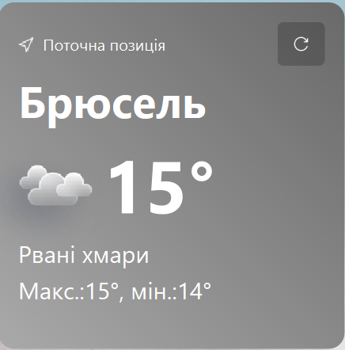
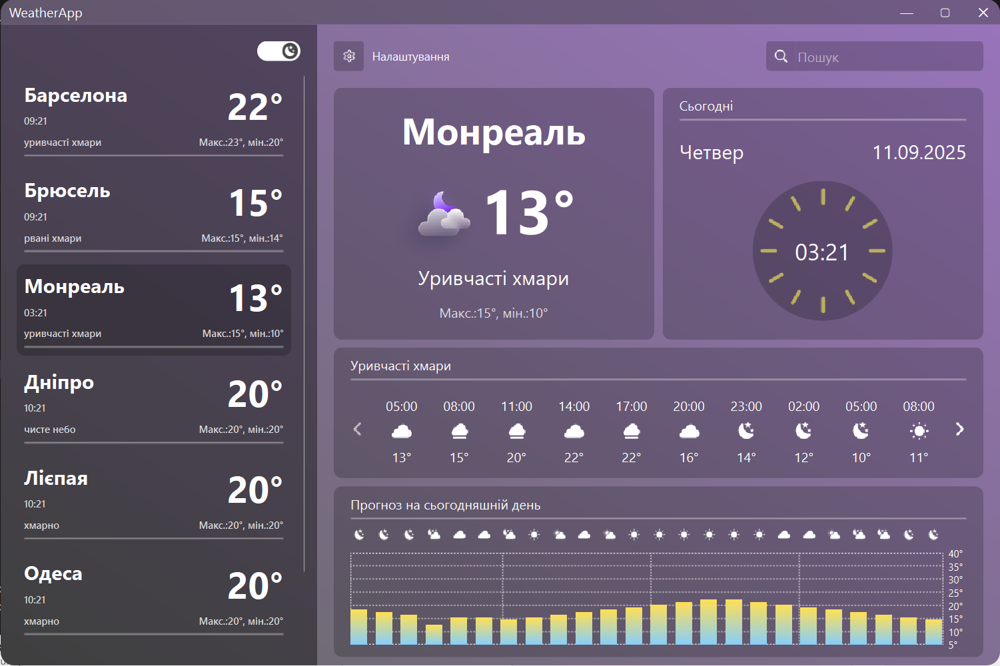
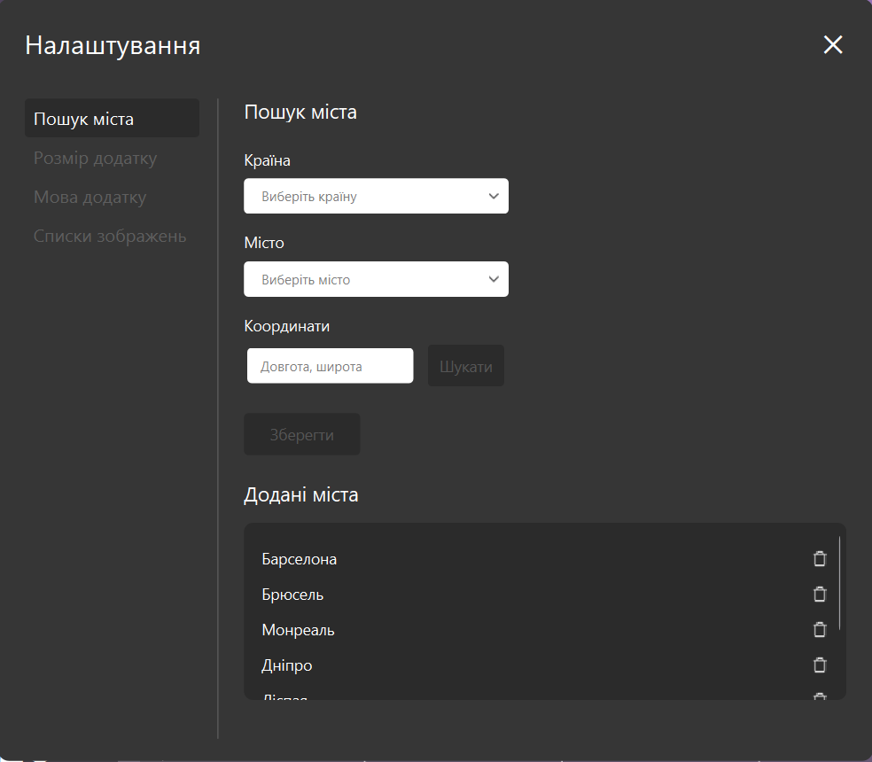

# 🌦️ WeatherApp

**WeatherApp** — це сучасний застосунок на Python + PyQt6 для відстеження погоди в різних містах світу. Підтримує українську та англійську мови, зміну теми, карти, налаштування та автоматичне оновлення прогнозів.

---
## Зміст:
1. [Інтерфейс](#-інтерфейс)
2. [Основні можливості](#-основні-можливості)
3. [Використані API](#-використані-api)
4. [Налаштування .env файлу](#-налаштування--env-файлу)
5. [Локалізація](#-локалізація)
6. [Зміна кольору фону](#-зміна-кольору-фону)
7. [Основні JSON-файли](#основні-json-файли)
8. [Робота з містами](#робота-з-містами)
9. [Розробник](#-розробник)
10. [Установка та запуск](#-установка-та-запуск)

---
## 🖼️ Інтерфейс

> На вітальному віджеті зображене сотаннє обране місто. Також є кнопка для оновлення погоди.


> Головне вікно з усім функціоналом.


> Налаштування для керуванням додатком.

---
## ✨ Основні можливості
- Додавання міст для відстеження погоди.

- Поточна погода для обраного міста.

- Прогноз на 5 днів з інтервалом в три години та детальний почасовий прогноз на поточний день.

- Автоматичне визначення назви міста за координатами при додаванні через налаштування.

- Відображення карти для обраного міста в налаштуваннях.

- Комплітер для пошуку міст в основній панелі (працює через JSON або базу даних — налаштовується).

- Комбобокс із країнами та містами в налаштуваннях (працює через JSON або базу даних — налаштовується).

- Можливість змінити тему застосунку (світла / темна).

- Детальні налаштування застосунку:

  - зміна мови (UA / ENG);

  - вибір іконок погоди (2 варіанти);

  - налаштування розміру головного вікна;

  - керування списком міст (додавання / видалення).

- Зміна кольору фону застосунку залежно від поточного типу погоди.

---
## 🔗 Використані API
### 1. 🌤️ OpenWeatherMap API
  - **Роль:** Отримання поточної погоди та прогнозу на 5 днів.

  - **Документація:** https://openweathermap.org/api

  - **Приклад запиту для поточної погоди:**
    ``` http
    GET https://api.openweathermap.org/data/2.5/weather?q=CITY_NAME&appid=YOUR_KEY&units=metric&lang=ua
    ```
  - **Приклад запиту для прогнозу на 5 днів:**
    ``` http
    GET https://api.openweathermap.org/data/2.5/forecast?q=CITY_NAME&appid=YOUR_KEY&units=metric
    ```
  - **Використовується для:**
    - Поточна температура.
    - Мінімальна/максимальна температура.
    - Короткий опис погоди.
    - Код іконки.
      
### 2. 🌤️ WeatherAPI
  - **Роль:** Отримання почасового прогнозу на поточний день.

  - **Документація:** https://www.weatherapi.com/

  - Приклад запиту:
    ``` http
    GET http://api.weatherapi.com/v1/forecast.json?key=YOUR_KEY&q=CITY_NAME&days=1&aqi=no&alerts=no
    ```
  - **Використовується для:**
    - Почасовий прогноз.
    - Додаткові погодні показники для побудови графіка.

### 3. 🗺️ Geoapify API
  - **Роль:** Робота з геолокаціями та картами.

  - **Документація:** https://www.geoapify.com/
  - **Приклад запиту для отримання координат міста:**
    ``` http
    GET https://api.geoapify.com/v1/geocode/search?text=CITY_NAME+COUNTRY_NAME&format=json&apiKey=YOUR_KEY
    ```
  - **Приклад запиту для отримання карти:**
    ``` http
    GET https://api.geoapify.com/v1/geocode/reverse?lat=LAT&lon=LON&format=json&apiKey=YOUR_KEY
    ```

### 4. 🌍 GeoNames API
  - **Роль:** Переклад назв міст для підтримки української та англійської локалізації.

  - **Документація:** https://www.geonames.org/export/web-services.html

  - Приклад запиту:
    ``` http
    GET http://api.geonames.org/searchJSON?q=CITY_NAME&lang=uk&maxRows=1&username=USER_NAME
    ```
  - **Використовується для:**
    - Переклад назв міст.
    - Пошук міст українською та англійською.

---
## ⚙️ Налаштування .env файлу
```
API_KEY_W_MAP=your_openweathermap_api_key
API_KEY_W_API=your_weatherapi_key
API_KEY_GEO=your_geoapify_key
USER_NAME=your_geonames_username
```
>**Примітка:** Без належних API-ключів більшість функцій працювати не будуть.

---
## 🌍 Локалізація
Застосунок підтримує дві мови:
  - Українська.
  - Англійська.  
Локалізація впливає на весь інтерфейс.

---
## 🎨 Зміна кольору фону
Окрім теми, на колір фону також впливає погода в обраному місті:
|Тип погоди|Код іконки|Колір фону|
|----------|----------|----------|
|Сонячна|01d, 02d|градієнт #87CEFA, #FFDF56|
|Ніч|01n, 02n|градієнт #191970, #8A2BE2|
|Мала хмарність (день)|03d|градієнт #C0C0C0, #FFD27F|
|Мала хмарність (ніч)|03n|градієнт #696969, #9974BC|
|Хмарність|04d, 04n|градієнт #A9A9A9, #696969|
|Дощ|09n, 09d, 10d, 10n|градієнт #808080, #5DACE2|
|Злива|11d, 11n|градієнт #4A4A4A, #5DACE2|
|Сніг|13d, 13n|градієнт #FFFFFF, #B0C4DE|

---
## Основні JSON-файли
1. **Конфігураційний JSON**  
  Файл: ```config.json```  
  Призначення: зберігає налаштування користувача та список доступних міст.  
  **Приклад структури:**
  ``` json
  {
      "cities": {
          "ua": ["Барселона", "Брюсель", "Львів"],
          "eng": ["Barcelona", "Brussels", "Lviv"]
      },
      "selected_city_name": "Брюсель",
      "selected_theme": "dark",
      "main_window_size": "1200x800",
      "selected_icons_folder": "icons2",
      "selected_lang": "ua"
  }
  ```
  >💡 **Примітка:**  
  >Цей файл є обов'язковим.  
  >Зміни в ньому впливають на зовнішній вигляд та поведінку додатку.
2. **JSON для локалізації**  
  Файл: ```lang.json```  
  Призначення: зберігає усі текстові підписи для UI українською та англійською.  
  **Приклад структури:**
  ``` json
    {
      "eng": {
          "settings_caption": "Settings",
          "today_caption": "Today",
          "save_btn_caption": "Save"
      },
      "ua": {
          "settings_caption": "Налаштування",
          "today_caption": "Сьогодні",
          "save_btn_caption": "Зберегти"
      }
  }
  ```
3. **JSON для типів погоди**  
  Файл: ```weather_types.json```  
  Призначення: визначає, які коди погоди відповідають певним типам умов, щоб підібрати правильні іконки та змінити фон програми.  
  **Приклад структури:**
  ``` json
  {
      "sunnyWeather": ["01d", "02d"],
      "nightWeather": ["01n", "02n"],
      "rainyWeather": ["09d", "10d"],
      "snowyWeather": ["13d", "13n"]
  }
  ```
  >🌤 Програма отримує код погоди з API та автоматично змінює фон і підібрані іконки.

---
## Робота з містами
JSON (файли grouped_cities.json та countries_cities.json) + База даних — застосунок дозволяє використовувати як JSON-файли, так і базу даних для:

- Заповнення QComboBox зі списком країн (в налаштуваннях).

- Заповнення QComboBox зі списком міст (в налаштуваннях).

- Групування міст за префіксами (для роботи комплітера).

---
## 🧑‍💻 Розробник

- Ім’я: Гліб Пронін
- Роль: Розробник застосунку медіаплеєра
- GitHub: [glib-pronin](https://github.com/)

---
## 📦 Установка та запуск

1. клонування репозиторію:
```
git clone <тут посилання>
cd weatherapp
```

2. Встановлення залежностей:  
```
pip install -r requirements.txt
```

3. Запуск:  
```
python main.py
```
